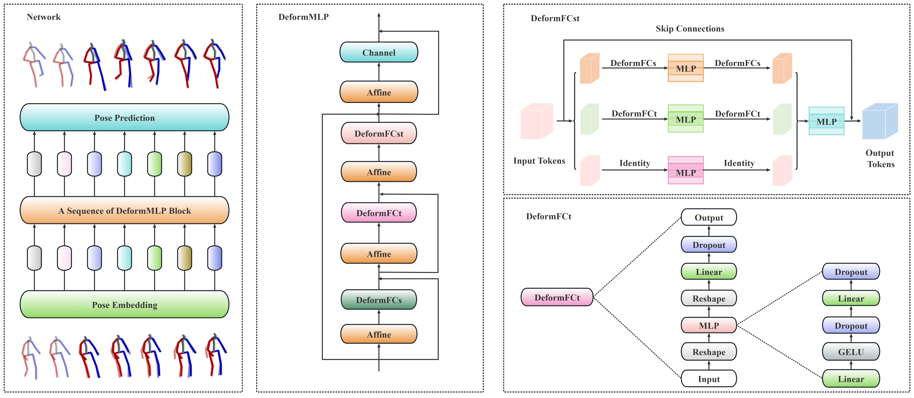

<div align="center">
<h1>DeformMLP:Dynamic Large-scale Receptive Field MLP Networks for Human Motion Prediction </h1>


Official PyTorch Implementation of the paper: DeformMLP:Dynamic Large-scale Receptive Field MLP Networks for Human Motion Prediction.

Haitao Huang, Chi-Man Pun, Haolun Li, Mengqi Liu, Jian Xiong , Hao Gao


</div>

<div align="middle">

</div>


## Installation

To setup the environment:
```sh
cd DeformMLP
conda create -n DeformMLP python=3.6.13
conda activate DeformMLP
pip install -r requirements.txt
```

## Data

Due to licensing it is not possible to provide any data. Please refer to [STSGCN](https://github.com/FraLuca/STSGCN) for the preparation of the dataset files.

## Training

To train the model on h36m or amass, you can use the following commands:
 ```
 python h36m/train_mixer_h36m.py --input_n 10 --output_n 25 --skip_rate 1 
 ```
 ```
 python 3dpw/train_mixer_3dpw.py --input_n 10 --output_n 25 --skip_rate 5 
 ```

 ## Evaluation

To test the pretrained models, you can use the following commands:
 ```
 python h36m/test_mixer_h36m.py --input_n 10 --output_n 25 --skip_rate 1 
 ```
 ```
 python 3dpw/test_mixer_3dpw.py --input_n 10 --output_n 25 --skip_rate 5 
 ```

 ## Models

We release the pretrained models for academic purpose. You can download them from [Google Drive](https://drive.google.com/drive/folders/1Ksdybq2qC8xpT7gACtreLpAmzA0fKU5L). Unzip the .zip file in the ```/checkpoints``` directory.

 ## Acknowledgments

 Some of our code was adapted from [HisRepsItself](https://github.com/wei-mao-2019/HisRepItself), [MotionMixer](https://github.com/MotionMLP/MotionMixer) and [STSGCN](https://github.com/FraLuca/STSGCN). We thank the authors for making their code public.

